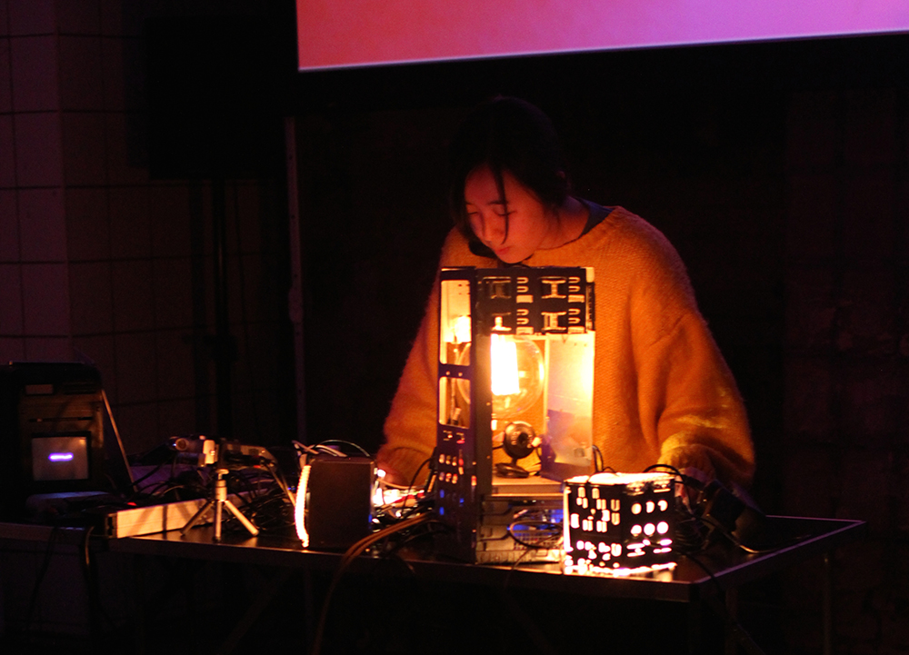

# [Team-Project] — Creative Motion Control Course Site

## Team Members

  
  <h3>Sabina Hyoju Ahn</h3>
  
<em>PhD Candidate, MAT, UCSB</em>

  
Artist and researcher working with sound, biological systems, and computational media. This site documents motion control experiments, prototyping, and project development for the course.

  
  <h3>Felix Yuan</h3>
  
<em>M.S./PhD Media Arts & Technology, UCSB</em>

  
Artist and developer interested in how artwork push the boundary of human perception and corporality. Thinking and excited about exploring machinary corporality in this course.

<!-- Copy the block above to add more team members -->

## Projects

| Project | Description |
|---------|-------------|
| [Project 1 Proposal](projects/project1_Proposal/docs/) | Modular motion Plotter |
| [Project 1](projects/project1/docs/) | Modular motion Plotter |

<!-- Add rows as you complete more projects:
| [Project 2](projects/project2/docs/) | *Brief description of project 2* |
| [Project 3](projects/project3/docs/) | *Brief description of project 3* |
-->
