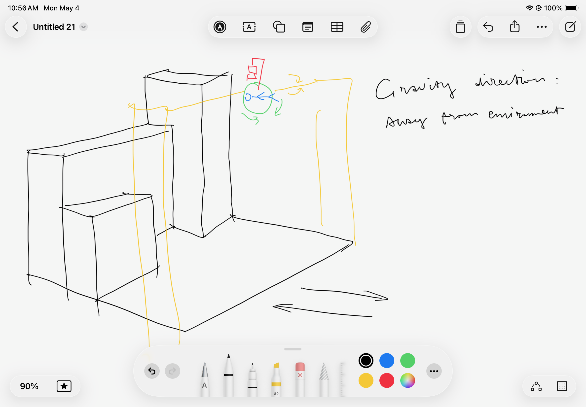
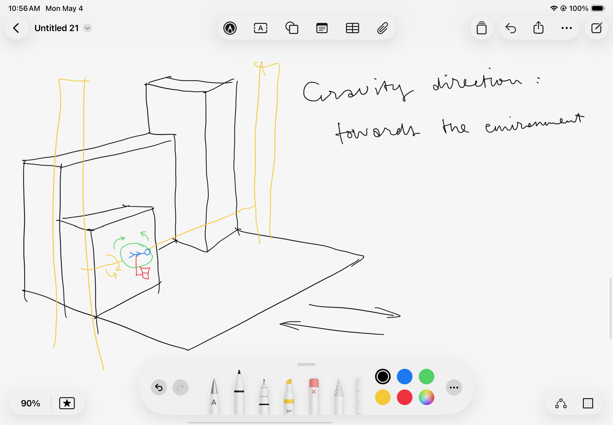
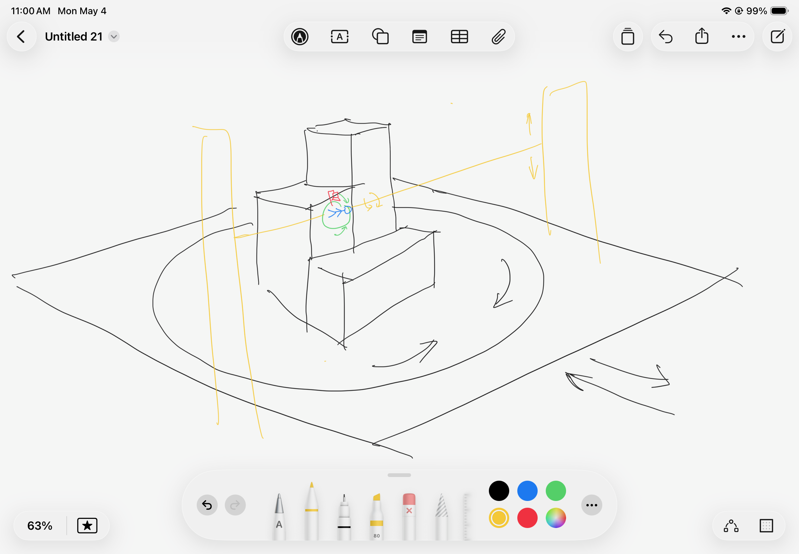
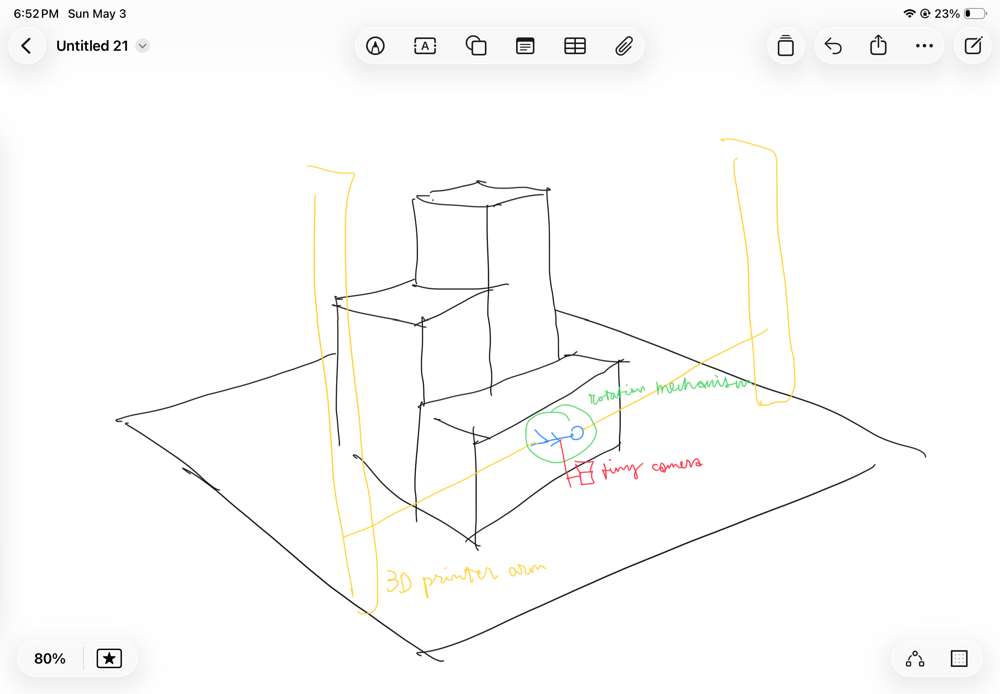
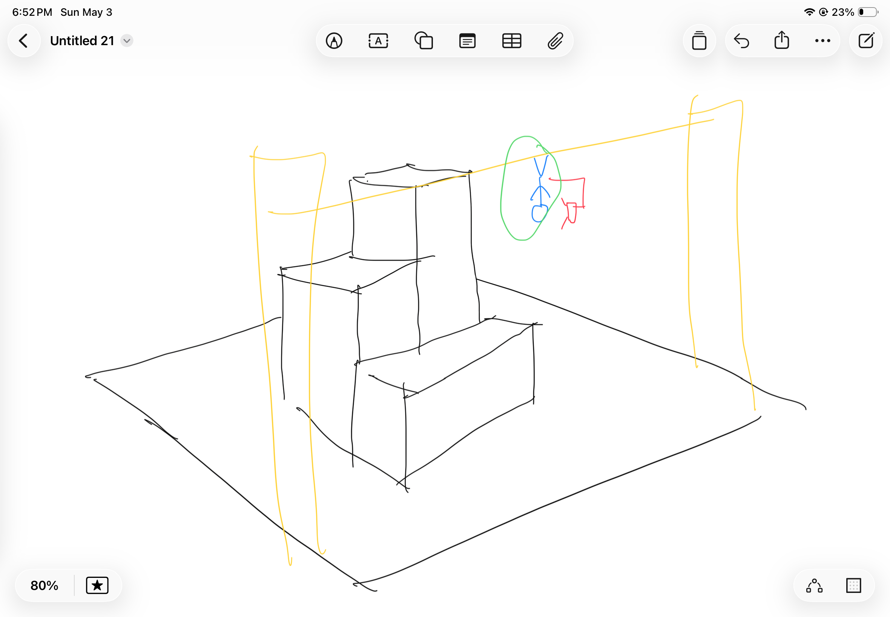

# Project 2 Proposal

## Anti Gravity 3D Printer Movement

## Inspiration and Idea

Us human has always been fascinated with the idea of zero-gravity or alter-gravity environments and experiences. We build rollercoasters, we film movie scenes of characters running on the outside of the sky scrapers, we send people into space, we do bungee jumping, aerial dancing, and constantly dream of flying. 

|  |  |
| :---: | :---: |
| Reverted gravity in manga _Bleach_ | NASA Alter-G treadmill for zero-gravity training |

Some youtubers have been building large scale human sized anti-gravity machines for entertainment purposes.

<iframe src="https://youtu.be/gSDtNkKPiDg?si=qJzZDHxxbTCgLuS7" style="position:absolute;top:0;left:0;width:100%;height:100%;" frameborder="0" allow="autoplay; fullscreen; picture-in-picture" allowfullscreen></iframe>

<iframe src="https://youtu.be/GtryF3ltNwE?si=z9W5EbBU-gI3gbxy" style="position:absolute;top:0;left:0;width:100%;height:100%;" frameborder="0" allow="autoplay; fullscreen; picture-in-picture" allowfullscreen></iframe>

And when we look at tools like 3D printers or 3D doodlers, they essentially leave traces of their movement within the 3D space, and the traces stay at its original position without being dragged down by gravity, and create artifacts in dis way. So what would it feel like, to live in this process of creating artifacts that was not dragged down by gravity. 

But both the 3D printer and the 3D doodlers have limited movement to some extent. There's only one direction for a 3D printer to extrude materials and one direction for supporting the artifacts from gravity, no rotations and the moving trail is constrained by the structure of the machine. 3D doodlers on the other hand, have much better flexivility but are fully manual in control.

This project tend to build and interactive system that, focus on the movement of 3D printer head, extend the degree of freedom of the movement and provide user with a sized-down experience of anti-gravity or alter-gravity movement.

For downsizing the user's perception of presence to the scale of a 3D printer head, we'll create a downsized city and create a thrid-person perspective.

<iframe src="https://youtu.be/Zel9kF8QJeE?si=rjyIJCg0F-H69Vd9" style="position:absolute;top:0;left:0;width:100%;height:100%;" frameborder="0" allow="autoplay; fullscreen; picture-in-picture" allowfullscreen></iframe>

## Proposed Design

Within a 3D printer sized space, a lego-man sized figure is representing the user. The figure is mounted with a tiny camera behind it to create a third person perspective, and also attched to with a machine to support the figure to move around in a zero-gravity or alter-gravity way within this space. The machine is either an altered 3D printer or a tiny robotic arm built from scratch. The space will be a 3D printed small-sized city environment with buildings, walls, platforms etc.

The user will be able to control the figure's moving in the space, jump and walk on the wall, or walk reversely on the sky, and the camera will provide a third person perspective, creating a feeling of presence, and an experience of fighting the gravity.

## Planned Implementation

The most important part of the peoject is to recreating a sense of presence for the user during the gravity direction switch process. And then allow the user to move within the corresponding plane under the new gravity direction on the surface of the city model, or to call the environment.

Due to the limit of the 3D printer's arm's collision with the environment, it is difficult to integrate current 3D printer with a multiple layered environment without basically customizing the whole machine. There're certain ways to simplify the process.

One is to limit the environment to one side and limit user's choice of gravity direction to only 4, namely down, up, toward and away from the environment. This can be accmoplished by the design shown below, which demonstrated gravity when toward and away from the environment without the arm fighting the environment.

|  |  |
| :---: | :---: |

The other way is to add a rotating plane within the printing platform. So that the user can land on any side of the environment. This way the all 6 direction of gravity can be supported, and with the third perspective view of the camera, the user are expected to feel the figure switching the environment, instead of the environment rotating.

If the environment is overall cynlinder, it would provide even more avaliable directions of the gravity.

The most crucial requirement for the installed city model or the environment is that it is generally convex, so that the figure won't need to get in the environment dragging the 3D printer arm behind, avoiding fully customing the machine or using a robotic arm.

The rotation head will have 2 degrees of freedom. One within the plane of the figure, allowing the user to turn 360 degrees and walk around. The other being perpendicular to the plane, used in gravity shifting process. Combining these two DOF with the up/down movement of the printer arm, the forward/backward movement of the printing plane and the rotation of the printing plane if included, will together support user's choice of gravity direction, and the gravity shifting process.

Some more algorithm and menthods are needed for:
    1. Keeping the figure's feet to the "ground" according to the given gravity direction.
    2. Pre-mark the environment's position so no sensor is needed for detecting the environment, and also figure out the position of the figure.
    3. When user is at the boundary of the environment, rotate gravity so the user keep walking on the otherside if the environment.
    4. When user choose to switch gravity, slowly turn figure around or make space for environment rotation if needed, so it either feels like falling into the sky or jump up and land in a different gravity.

## Major Challenges / Questions

1. Not very sure if this is 100% viable. Seems a little too ambitious for the time and rescources. Is tiny camera gonna fit?
2. The machine part of the rotation mechanism.

## Materials Required

1. Tiny camera.
2. 3D printer avaliable for modification.
3. Rotater of the printer head and arm, or materials for making them.
4. A tiny human-like figure that can be mounted to the printer head.

<!-- 
What existing projects (your own or the work of others) inspired you for this idea?
Include example images and videos!

Example Image

Example Video Embedding

<iframe src="https://player.vimeo.com/video/196317031?h=6e5e7b8b2e" style="position:absolute;top:0;left:0;width:100%;height:100%;" frameborder="0" allow="autoplay; fullscreen; picture-in-picture" allowfullscreen></iframe>

<a href="https://vimeo.com/196317031">Sample Vimeo Video</a> from <a href="https://vimeo.com/user123456">Vimeo User</a> on <a href="https://vimeo.com">Vimeo</a>.
 -->

<!-- 

<iframe src="https://www.youtube.com/watch?v=gSDtNkKPiDg&t=343s" style="position:absolute;top:0;left:0;width:100%;height:100%;" frameborder="0" allow="autoplay; fullscreen; picture-in-picture" allowfullscreen></iframe>
 

<iframe src="https://www.youtube.com/watch?v=GtryF3ltNwE" style="position:absolute;top:0;left:0;width:100%;height:100%;" frameborder="0" allow="autoplay; fullscreen; picture-in-picture" allowfullscreen></iframe>
 -->

<!-- |  |  |
| :---: | :---: |
| Example 1 | Example 2 | -->

<!-- <iframe width="560" height="315" src="https://youtu.be/gSDtNkKPiDg?si=qJzZDHxxbTCgLuS7" title="YouTube video player" frameborder="0" allow="accelerometer; autoplay; clipboard-write; encrypted-media; gyroscope; picture-in-picture; web-share" referrerpolicy="strict-origin-when-cross-origin" allowfullscreen></iframe>

<iframe width="560" height="315" src="https://youtu.be/GtryF3ltNwE?si=z9W5EbBU-gI3gbxy" title="YouTube video player" frameborder="0" allow="accelerometer; autoplay; clipboard-write; encrypted-media; gyroscope; picture-in-picture; web-share" referrerpolicy="strict-origin-when-cross-origin" allowfullscreen></iframe>

<iframe width="560" height="315" src="https://youtu.be/Zel9kF8QJeE?si=rjyIJCg0F-H69Vd9" title="YouTube video player" frameborder="0" allow="accelerometer; autoplay; clipboard-write; encrypted-media; gyroscope; picture-in-picture; web-share" referrerpolicy="strict-origin-when-cross-origin" allowfullscreen></iframe> -->