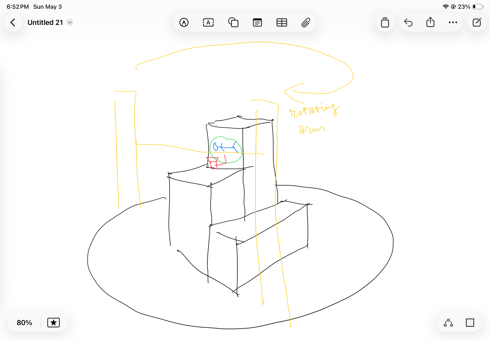

# Project 2 Proposal

## Anti Gravity 3D Printer Movement

## Inspiration and Idea

Us human has always been fascinated with the idea of zero-gravity or alter-gravity environments and experiences. We build rollercoasters, we film movie scenes of characters running on the outside of the sky scrapers, we send people into space, we do bungee jumping, aerial dancing, and constantly dream of flying. 

|  |  |
| :---: | :---: |
| Reverted gravity in manga _Bleach_ | NASA Alter-G treadmill for zero-gravity training |

Some youtubers have been building large scale human sized anti-gravity machines for entertainment purposes.
| <iframe src="https://www.youtube.com/watch?v=gSDtNkKPiDg&t=343s" title="Anti-gravity machine 1"></iframe> | <iframe src="https://www.youtube.com/watch?v=GtryF3ltNwE" title="Anti-gravity machine 2"></iframe> |

And when we look at tools like 3D printers or 3D doodlers, they essentially leave traces of their movement within the 3D space, and the traces stay at its original position without being dragged down by gravity, and create artifacts in dis way. So what would it feel like, to live in this process of creating artifacts that was not dragged down by gravity. 

But both the 3D printer and the 3D doodlers have limited movement to some extent. There's only one direction for a 3D printer to extrude materials and one direction for supporting the artifacts from gravity, no rotations and the moving trail is constrained by the structure of the machine. 3D doodlers on the other hand, have much better flexivility but are fully manual in control.

This project tend to build and interactive system that, focus on the movement of 3D printer head, extend the degree of freedom of the movement and provide user with a sized-down experience of anti-gravity or alter-gravity movement.

For downsizing the user's perception of presence to the scale of a 3D printer head, we'll create a downsized city and create a thrid-person perspective.

<iframe src="https://www.youtube.com/watch?v=Zel9kF8QJeE" title="Third person perspective" allowfullscreen></iframe>

## Proposed Design

Within a 3D printer sized space, a lego-man sized figure is representing the user. The figure is mounted with a tiny camera behind it to create a third person perspective, and also attched to with a machine to support the figure to move around in a zero-gravity or alter-gravity way within this space. The machine is either an altered 3D printer or a tiny robotic arm built from scratch. The space will be a 3D printed small-sized city environment with buildings, walls, platforms etc.

The user will be able to control the figure's moving in the space, jump and walk on the wall, or walk reversely on the sky, and the camera will provide a third person perspective, creating a feeling of presence, and an experience of fighting the gravity.

## Planned Implementation

|  |  |
| :---: | :---: |
| Example 1 | Example 2 |

IDK how to say dis yet...

## Major Challenges / Questions

1. Not very sure if this is 100% viable. Seems a little too ambitious for the time and rescources. Is tiny camera gonna fit?
2. If were to modify the 3D printer, the environment will need to be much less complex, as the arms of the 3D printer will get in the way. Might affect how presence the environment feels.
3. Mechanism to have the figure's feet always touching, or close to touching the surface of the environment, contingent on the direction of the movement. Rotation and detection might be very complex. Should just use pre-written obstical positions? Also how to design the rotation mechanism.

4. The arm might get in the way so could use a rotating arm support system? But dis way it's bascially a custom machine.

## Materials Required

1. Tiny camera.
2. 3D printer avaliable for modification.
3. Alternative 3D printer arm and rotater of the printer head, or materials for making them.
4. A tiny human-like figure that can be mounted to the head.
4. Potentially sensors, for slowing down the movement when about to hit the buildings.

<!-- 
What existing projects (your own or the work of others) inspired you for this idea?
Include example images and videos!

Example Image

Example Video Embedding

<iframe src="https://player.vimeo.com/video/196317031?h=6e5e7b8b2e" style="position:absolute;top:0;left:0;width:100%;height:100%;" frameborder="0" allow="autoplay; fullscreen; picture-in-picture" allowfullscreen></iframe>

<a href="https://vimeo.com/196317031">Sample Vimeo Video</a> from <a href="https://vimeo.com/user123456">Vimeo User</a> on <a href="https://vimeo.com">Vimeo</a>.
 -->

<!-- 
<iframe src="https://www.youtube.com/watch?v=gSDtNkKPiDg&t=343s" style="position:absolute;top:0;left:0;width:100%;height:100%;" frameborder="0" allow="autoplay; fullscreen; picture-in-picture" allowfullscreen></iframe>
 

<iframe src="https://www.youtube.com/watch?v=GtryF3ltNwE" style="position:absolute;top:0;left:0;width:100%;height:100%;" frameborder="0" allow="autoplay; fullscreen; picture-in-picture" allowfullscreen></iframe>
 -->